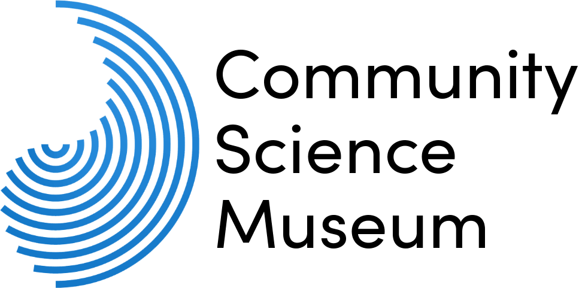

# Community Science Museum



## Description
This website was made during my first year as a front–end dev student, and was my second try at creating a website.
CSM is a fictional website for a local science museum that wants to further engage children and families in learning and exploring the wonders of this world. The site is bright and colorful, but not in a very childish way. 

## Built With

- HTML
- CSS 
- JS

## Getting Started

### Installing
1. Clone the repo:

```bash
git clone git@github.com:StianSto/Community-Science-museum__Stian-Stordal.git
```

<!--### Running
To run the app, run the following commands:

```bash
npm run start
```-->

## Contributing

make sure to make a pull request so code can be reviewed :)

## links
website: https://condescending-pike-cf9508.netlify.app

Prototype: <br>
pc: https://xd.adobe.com/view/9e2e1e38-b57d-43a2-b18a-d70ed6e583ac-cb7d/ <br>
mobile:https://xd.adobe.com/view/892fb3f8-f0f4-4393-b13f-f9fb66411e23-dc7c/

## Contact

:envelope: stordalstian@gmail.com
